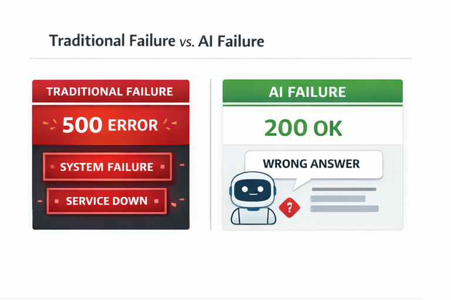
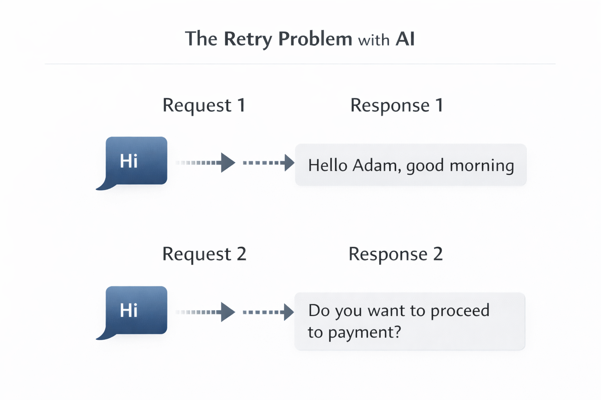
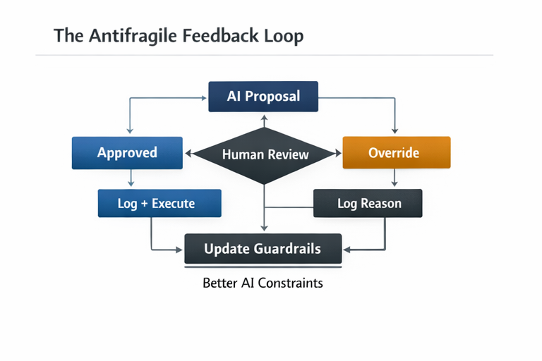

# Failure as a Design Input

## Moving from Resilient to Antifragile

**Ogonna Nnamani**
Senior DevOps Engineer

API Connect — Lagos, 2026

---

---

# Part 1: Resilience Is Not Enough

---

## The Spectrum You're Not Using

Most engineering teams treat "resilient" as the ceiling. It isn't.

There's a spectrum that Nassim Nicholas Taleb introduced, and it changes
how you think about every system you build:


A **fragile** system breaks when things go wrong.
A database with no backups. A monolith with no health checks.

A **resilient** system absorbs shock and returns to its original state.
Circuit breakers trip, retries succeed, the system recovers.
This is where most of your systems live today.

An **antifragile** system gets *better* when things go wrong.
Every failure teaches it something. Every incident tightens a constraint.
The system after the outage is stronger than the system before it.

Here's the problem: almost everything we build stops at resilience.
We design for recovery. We should be designing for growth.

---

## Why This Matters Now

Two forces are colliding:

**Force 1: AI is entering your backend.**
Your APIs are starting to call LLMs, use AI-powered decision engines,
or serve responses generated by models. These components don't fail
the way traditional services fail. They don't crash — they drift.
They return 200 OK with a wrong answer.



**Force 2: AI is consuming your APIs.**
Agents are calling your endpoints. They don't read docs.
They don't exercise judgment. They retry without getting tired.

Your resilience patterns were built for a world where failure
announces itself with a 500 status code. That world is ending.

The question is no longer "can my system recover from failure?"
It's "can my system learn from failures it can't even identify?"

That's the shift from resilient to antifragile.

---

---

# Part 2: Your Resilience Patterns Are Showing Their Age

---

Four patterns every senior engineer knows.
Each one has a blind spot that AI exposes.

---

## Pattern 1: Retries

**What you know:**
On transient failure, retry with exponential backoff.
The assumption: the correct result is waiting on the other side of
the transient error. Retry enough times and you'll get it.

**What changed:**
When your backend includes an AI component, retrying doesn't give you
the same result after the error clears. It gives you a *different* result.
Your second attempt might be worse than your first.





AIR CANADA INCIDENT
Air Canada was sued by a Mr Mofatt because their Chatbot gave him false information and he thought he was getting a refund
https://www.cbc.ca/news/canada/british-columbia/air-canada-chatbot-lawsuit-1.7116416


Think about what this means: your retry logic is now a source of
non-determinism, not a defense against it. The retry that "succeeds"
might give you a worse answer than the attempt that timed out.

**The antifragile response:**
Pin the AI's decision on first successful call. Cache the semantic output,
not just the HTTP response. Retries should return the *pinned* result,
not a fresh generation.

```python
def get_recommendation(request_id, input_data):
    # Check if we already have a pinned decision
    pinned = cache.get(f"pinned:{request_id}")
    if pinned:
        return pinned  # Same semantic decision every time

    result = ai_backend.generate(input_data)
    cache.set(f"pinned:{request_id}", result, ttl=3600)
    return result
```

Your retry logic stays the same. But now it retries against a pinned result,
not a non-deterministic backend.

---

## Pattern 2: Circuit Breakers

**What you know:**
When error rates exceed a threshold, trip the circuit. Stop sending
traffic to a failing service. Give it time to recover.

**What changed:**
An AI-powered backend can degrade without ever returning an error.
Latency stays normal. Status codes stay 200. But the *quality* of
responses drops — lower confidence, higher variance, subtle drift
in recommendations. Your circuit breaker sees nothing wrong.

**The antifragile response:**
Extend your circuit breaker to watch semantic signals, not just HTTP signals:

```yaml
circuit_breaker:
  # Classic triggers (keep these)
  classic:
    error_rate_threshold: 0.50
    latency_p99_ms: 3000

  # Semantic triggers (add these)
  semantic:
    confidence_mean_below: 0.60
    output_variance_above: 0.30
    human_override_rate_above: 0.40

  fallback: deterministic_rules
```

When the AI backend becomes unreliable, you don't just stop traffic —
you fall back to deterministic rules. The system degrades gracefully
to a mode you fully control.

---

## Pattern 3: Idempotency

**What you know:**
An idempotent operation produces the same result regardless of
how many times it's called. Essential for safe retries and
at-least-once delivery guarantees.

**What changed:**
An AI-backed endpoint is *structurally* idempotent (same JSON schema)
but *semantically* variable (different content). Your idempotency key
prevents duplicate execution, but it doesn't prevent duplicate decisions
from being different.

```
POST /api/recommend  (idempotency-key: abc-123)
→ Response 1: { "action": "modify_rule", "target": "sg-04b7" }

POST /api/recommend  (idempotency-key: abc-123)  [retry]
→ Response 2: { "action": "replace_group", "target": "sg-04b7" }
```

Both responses are valid JSON. Both pass schema validation.
They recommend completely different actions.

**The antifragile response:**
Semantic idempotency — pin the decision, not just the execution:

```python
def idempotent_recommendation(idempotency_key, finding):
    existing = store.get(idempotency_key)
    if existing:
        return existing  # Semantic pin: same decision every time

    recommendation = ai_engine.propose(finding)
    store.set(idempotency_key, recommendation, ttl=86400)
    return recommendation
```

The caller gets the same *decision* on every retry, not just the same
status code.

---


## Pattern 4: Observability

**What you know:**
Monitor latency, error rates, throughput. Set alerts on anomalies.
Use distributed tracing to follow requests across services.

**What changed:**
A 200 OK with a wrong-but-plausible AI response doesn't trigger
any of your alerts. Latency is normal. Error rate is zero.
Throughput is healthy. Your dashboards are green.
Your system is silently degrading.

**The antifragile response:**
Add semantic observability — metrics that track *meaning*, not just *mechanics*:

```yaml
# What you monitor today
- metric: http_error_rate
  alert_above: 0.05

# What you need to add
- metric: ai_confidence_mean
  alert_below: 0.65
  window: 1h

- metric: human_override_rate
  alert_above: 0.30
  window: 24h

- metric: output_distribution_variance
  alert_above: 0.25
  window: 1h

- metric: recommendation_rollback_rate
  alert_above: 0.10
  window: 24h
```

The override rate is your most powerful signal. If humans keep
disagreeing with the AI, the AI is drifting. That's not a bug
to fix — it's a stress signal the system should absorb.

---

---

# Part 3: The Antifragile Feedback Loop

---

## Systems That Learn From Their Own Failures

Resilience is about surviving failure. Antifragility is about *metabolizing* it.

The difference is a feedback loop:



Every human override is a training signal.
Every approval is a confidence signal.
The guardrails tighten over time for well-understood cases
and stay flexible for novel ones.

**This is antifragility: the system gets stronger from disagreement.**

---

## Implementing the Loop

### Step 1: Capture the Decision Context

Every AI-generated action needs a full audit trail:


### Step 2: Let Guardrails Evolve

```yaml
# Guardrails evolve based on real feedback
security_group_remediation:
  v1.0:  # Initial: broad AI discretion
    allowed_actions: [modify_rules, replace_group, restrict_cidr]

  v1.1:  # After 30% override rate on replace_group
    allowed_actions: [modify_rules, restrict_cidr]
    requires_human_review: [replace_group]
```

The system evolves. Not because someone manually tuned it,
but because the feedback loop converted human judgment
into system constraints.

---

---

# Part 4: Measuring Where You Are on the Spectrum

---

## Antifragility Is Measurable

Taleb makes a point that most engineers miss: unlike risk,
fragility is actually measurable. You don't have to guess
where your system sits on the spectrum. You can instrument it.

Here are three metrics that tell you whether your system is
fragile, resilient, or antifragile. and none of them exist
in your current Grafana dashboard.

---

## Metric 1: The Override Rate

the override rate is the single most informative metric you can track.

```python
def fragility_score(finding_type, window_days=30):
    proposals = get_proposals(finding_type, days=window_days)
    overrides = [p for p in proposals if p.was_overridden]
    rollbacks = [p for p in proposals if p.was_rolled_back]

    override_rate = len(overrides) / len(proposals) if proposals else 0
    rollback_rate = len(rollbacks) / len(proposals) if proposals else 0

    # Fragile: high override AND high rollback
    # Resilient: low rollback, but override rate stays flat
    # Antifragile: override rate is DECREASING over time
    return {
        "override_rate": override_rate,
        "rollback_rate": rollback_rate,
        "trend": calculate_trend(finding_type, window_days),
        "classification": classify(override_rate, rollback_rate)
    }
```

A **fragile** system has a high override rate that stays high.
The same mistakes keep happening.

A **resilient** system has a low override rate, but it's flat.
The system doesn't fail, but it doesn't improve either.

An **antifragile** system has an override rate that *decreases
over time*. Each override made the system smarter.
The trend line is the signal.

---

## Metric 2: Time-to-Constraint

When a new failure mode appears, how long does it take your system
to develop a guardrail for it?

In a fragile system: the failure repeats indefinitely until a human
writes a fix. Weeks or months.

In a resilient system: the failure is caught and handled, but the
same class of failure can still occur. Days.

In an antifragile system: the feedback loop generates a new constraint
automatically from the override data. Hours.

Track this. If your time-to-constraint is shrinking, your system
is becoming more antifragile. If it's growing or undefined,
you're building resilience at best.

---

## Metric 3: Fallback Invocation Rate

How often does your system activate its deterministic fallback
because the AI component wasn't confident enough?

This isn't a failure metric — it's a *maturity* metric.

A system that never falls back is either overconfident or
undertested. A system that falls back constantly has an AI
component that isn't earning its place. The healthy range
is somewhere in between, and it should narrow over time
as the guardrails improve.

```yaml
# Track fallback behavior over time
- metric: fallback_invocation_rate
  healthy_range: 0.05 - 0.20
  alert_above: 0.35   # AI is unreliable
  alert_below: 0.01   # Are you actually checking confidence?
  window: 7d
```

---

## Putting It Together

```
┌─────────────────────────────────────────────────────┐
│           SYSTEM HEALTH DASHBOARD                   │
│                                                     │
│  Override Rate (30d):  ████████░░  18% ↓ trending   │
│  Time-to-Constraint:  ~4.2 hours (improving)        │
│  Fallback Rate (7d):  ██░░░░░░░░  12% (healthy)     │
│  Rollback Rate (30d): █░░░░░░░░░   3% (stable)      │
│                                                     │
│  Classification: ANTIFRAGILE (improving)             │
│                                                     │
└─────────────────────────────────────────────────────┘
```

These four numbers tell you more about your system's relationship
with failure than any error rate dashboard ever will.

The error rate tells you if the system is alive.
These metrics tell you if the system is *learning*.

---

---

# The Spectrum, Revisited

```
FRAGILE               RESILIENT               ANTIFRAGILE
  │                       │                        │
  │  System breaks        │  System recovers       │  System learns
  │  under stress         │  from stress           │  from stress
  │                       │                        │
  │  No error handling    │  Retries, circuit      │  Feedback loops
  │  No fallbacks         │  breakers, fallbacks   │  that tighten
  │  No monitoring        │  Dashboards, alerts    │  constraints
  │                       │                        │
  │  ← Most failures      │  ← Your systems        │  ← The goal →
  │     live here →       │     today →            │
```

Resilience is the floor, not the ceiling.

The systems that win in the AI era won't be the ones that never fail.
They'll be the ones that metabolize failure — converting every wrong answer,
every override, every unexpected drift into a tighter constraint
and a better guardrail.

**The fragile system breaks from AI.**
**The resilient system survives AI.**
**The antifragile system learns from AI's mistakes —
including the ones it can't define yet.**

---

---

# Resources

| Resource | Link |
| --- | --- |
| Antifragile: Things That Gain from Disorder (Taleb, 2012) | penguinrandomhouse.com/books/176227/antifragile-by-nassim-nicholas-taleb |
| Building Antifragile Systems for Modern DevOps — Part 1 | medium.com/@ogonnannamani11/building-anti-fragile-systems-for-modern-day-devops-part-1-b901b7c1953f |

---

---

# Thank You

Resilience keeps your system alive.
Antifragility makes it learn.

Every override is a training signal.
Every rollback is a constraint that needed tightening.
Every silent failure you catch is a guardrail you didn't have yesterday.

Design for that. Build the feedback loop.
Let your system get stronger from what goes wrong.

---

**Ogonna Nnamani**
Senior DevOps Engineer

medium.com/@ogonnannamani11
linkedin.com/in/ogonna-nnamani